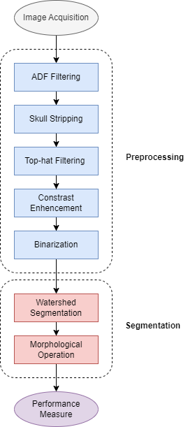
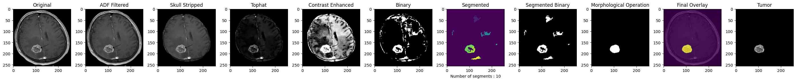
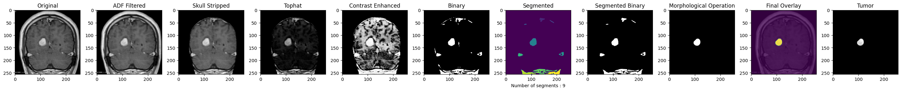
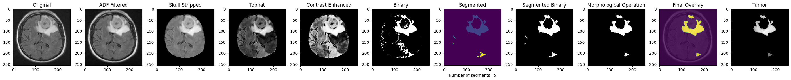
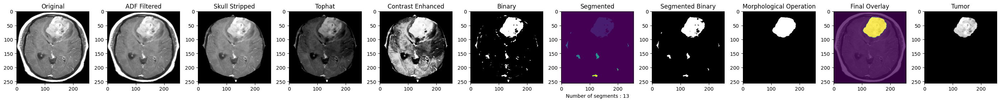
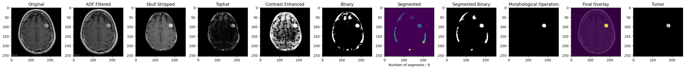
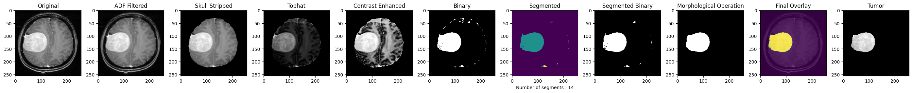
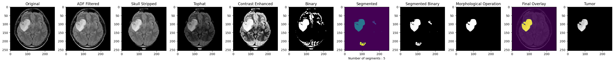
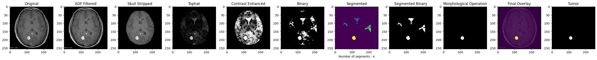

<h1 align="center">Brain Tumor Detection using Image Processing</h1>

  

    An approach through Anisotropic Diffusion, Top-hat Filtering, Histogram Equalization and Watershed Segmentation
  

## Objective

The primary objective of this project is to enhance the accuracy of brain tumor detection from Magnetic Resonance Imaging (MRI) scans. Leveraging advanced image processing techniques, specifically Anisotropic Diffusion Filtering (ADF) and Watershed Segmentation, this research seeks to provide a robust tool for early detection and accurate segmentation of brain tumors, thereby facilitating timely and effective treatment strategies.

For an in-depth understanding, refer to my articles detailing the journey and findings:
- 🇬🇧 [📰 Brain Tumor Detection using Image Processing](https://medium.com/wanabilini/brain-tumor-detection-using-image-processing-a26b1c927d5d)

## Methodology

Our methodology unfolds in a structured process aimed at improving the precision of tumor identification from MRI images. Key steps include:

1. 🩻 **Data Acquisition**: The dataset comprises 80 brain MRI images sourced from Kaggle, but for this study, we focused exclusively on 8 tumorous images to refine our segmentation techniques.
2. 🧼 **Preprocessing**:
  - **Anisotropic Diffusion Filtering**: to reduce noise while preserving important edge details, ensuring that the crucial information is retained for accurate segmentation.
   - **Skull Stripping**: to isolate the brain tissue from the MRI images by removing non-brain tissues, allowing for a focused analysis on the tumor areas.
   - **Contrast Enhancement**: to improve the visibility of tumor regions against the surrounding tissues, making the tumors more distinguishable, by using Histogram Equalization (HE).
   - **Top-hat Filtering**: to highlight small bright structures, such as tumors, against a dark background, further improving the clarity of tumor regions.
   - **Binarization**: to convert grayscale images to binary format, simplifying the image by focusing on the most relevant information for tumor identification. This step involves setting a threshold to retain pixels with intensities that signify tumor presence.
3. ✂️ **Segmentation**:
  - **Watershed Segmentation**: to accurately delineate tumor boundaries within the preprocessed images. This region-based segmentation method is crucial for separating adjacent objects in the image, especially in areas where the boundary between the tumor and normal brain tissue is not clearly defined.
  - **Morphological Operations**: to refine the results of segmentation, smoothing the edges of the segmented tumor, removing small artifacts, and filling in gaps within the tumor region.
9. 📊 **Performance Evaluation**: to measures various statistical and textural metrics such as Mean intensity, Entropy, Smoothness, RMS, PSNR, and GLCM features (Contrast, Correlation, Energy, Homogeneity)

  

The entire process emphasizes preserving crucial image details while significantly reducing noise, thereby enabling more accurate segmentation and identification of tumor regions.

## Results & Discussion

Our findings demonstrate notable enhancements in the processed MRI images at each stage of the applied methodology.

  

  

  

  

  

  

  

  

## Conclusion

This project, conducted with Python and scikit-image, successfully demonstrates the effectiveness of advanced image processing techniques in the segmentation of brain tumors from MRI scans, opening avenues for their use in various other medical and non-medical applications.

Moreover, the integration of textural features with machine learning classifiers emerges as a promising direction for future research. Our work invites further validation across diverse datasets, aiming to solidify its applicability and effectiveness in real-world medical settings.

## Contact #

If you have any questions or would like to connect:

- 📬 Email me at [mlachahe.saidsalimo@gmail.com](mailto:mlachahe.saidsalimo@gmail.com)
- 🟦 Connect with me on [LinkedIn](https://www.linkedin.com/in/mlachahesaidsalimo/)
- ⬛ Read my thoughts on [Medium](https://medium.com/@mlachahesaidsalimo)
